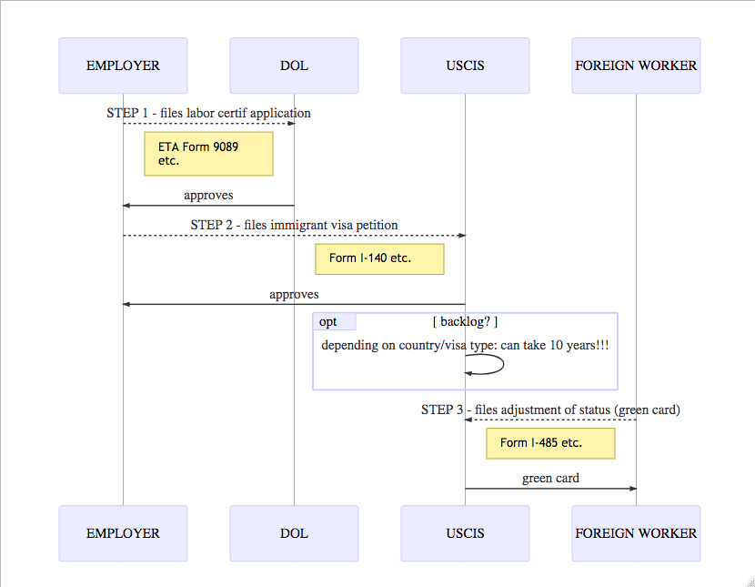
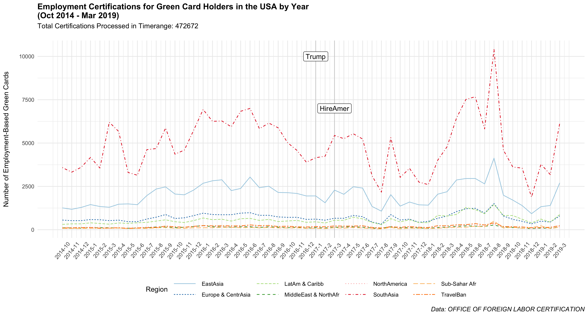

> Implementing the electoral promise to: _“Buy American and HIRE American”_ … by slowing down one green card petition at a time 

Any immigrant to the U.S. who received the green card in the mail will admit to breathing a sight of relief after a process that - depending on circumstances - can amount to years, thousands of pages in paperwork, huge government and lawyers' fees, plus the stress of navigating American ever changing immigration law.

Since the beginning, immigration has been a major priority of President Trump's policy and rethoric. Two weeks into his term, he signed the inflamatory Executive Order _"Protecting the Nation from Foreign Terrorist Entry into the United States"_, also known as the "Travel Ban", later revised and further adjusted. Soon after (April 2017), another Executive Order was signed that made explicit reference to Trump's electoral promise to: _"Buy American and Hire American"_, which included tightening the rules for H-1B visas (the most common way to temporarily sponsor foreign workers). This visa is actually the "gateway" into permanent residence status (a.k.a. the green card), given that most of those who achieve "employment-based permanent residence" were previously H-1B visa holders (77% over the period 2014-2019).

Complaints have ensued from US companies, trying to hire or retain their foreign employees, for the excessive vetting and lagging processing times. Are there any available public data to validate these claims? Has the Trump administration actually slowed down the green card application process for foreign workers?

### The process 
Before addressing this question, it is important to understand the process of obtaining a green card on the basis of employment (which is different from cases based on family relations, asylum, refugee status, etc.). The diagram below illustrates the key steps in the process and the respective U.S. Government Agencies in charge.

+ Step 1: **"PERM" Labor Certification (ETA Form 9089)**: The Department of Labor (DOL), specifically the Office of Foreign Labor Certification (OFLC) receives from the employer the application of an "alien employment certification" and verifies that the conditions are in line with the market and efforts were made to advertise the job opening and recruit competitve American candidates. 

+ Step 2: **Immigrant Petition (form I-140)**: If the labor certification is granted, the employer can file an immigration petition with the U.S. Citizenship and Immigration Service (USCIS) on the premise of the labor certification.

+ Step 3: **Adjustment of Status (form I-485)**: If the immigration petition is approved, **AND** there is an available visa in the allowed quota per country of birth (in USCIS jargon, "current priority date" or no "backlog"), the employee applies for adjustment of status to U.S. permanent resident. 
	+ Due to backlog, citizens of certain countries (China, El Salvador, Guatemala, Honduras, India, Mexico, Philippines, Vietnam) must wait several years.

 

### Some evidence
Luckily, the DOL's Office of Foreign Labor Certification, releases highly granular data on foreign labor certifications granted for Permanent, H-1B and many other visas. The datasets provide a wealth of information including the perspective job's details and charateristics of the foreign worker. 

In terms of the amount of certifications granted (aggregated by region in the chart below), overall there is no evidence that the numbers have lowered during Trump's term, let aside some seasonality. Not even the countries under the "Travel Ban" showed any significant change in patterns. Actually, the average processing time during Trump's administration fell to 3.8 months from and average of 6.7 months under Obama (2014-2016) - which cannot be ascribed to stricter auditing, because the share of denied certifications remained substantially the same. 

Evidently, the first step of the process (under the purview of OFLC) was not affected by "Hire American" proclaims and understandably so. For one thing, the level of education and skills of the candidates are impressive (93% hold a graduate or postgraduate degree). Looking at most popular job titles, 24% contain the word "Software" in the description, followed by other highly specialized professionals engaged in Computer Systems and Engineering. Curiously, the only non "IT nerd" job title that makes the top 10 is "Poultry cutters and trimmers". Further down, but within the top 50, also some Truck Drivers, Caregivers and Physicians can be found. 

Perhaps the only somewhat puzzling figure retrieved form the OFLC dataset is that, for Indians, the percentage of cases with status "certified – expired" (i.e. the employer did not proceed to file form I-140 with USCIS), is a staggering 20.8% - the same figure is 3.5% for China and around 0% otherwise. Possibly, this confirms the hypothesis that delays get problematic between step 2 and 3, that is when the case moves to USCIS for approval of the immigration petition and subsequent adjustment of status. 

Unfortunately, USCIS is not as generous as OFLC in sharing data, but the agency recently released a table showing the aggregate processing time averages for each and every type of petition from 2015 to 2019. 
The numbers related to the I-485 applications are evidently lagging compared to previous years. Since FY2015, USCIS processing time has increased across all types of green card petitions, but especially for employment-based ones (now 89% lengthier). Notably, this is only the approval time for the adjustment of status. The worse part is the wait time for the actual permission to submit form I-485. Here, the country of birth becomes the main determinant because the visas are allotted according to country quotas. Keeping up with the quotas can get quite mystifying because they are re-weighted and revised constantly, but immigrants born in China, India, Mexico, and Philippines definitely have it worst. For instance, as of May 2019, the _"current priority date"_ for most type of employment-based green cards was 2009 for Indian born applicants... meaning those whose immigration petition was approved on or before 2009 can now seek adjustment of status! 

 

To be fair, processing backlogs were an issue long before President Trump took office, but some of the administration’s newly implemented policy changes certainly didn't help. Among them, the additional biometric appointments for applicants and their dependents (regardless of age), or the requirement that all employment-based green card applicants attend in-person interviews. In case you were wondering whether the long shutdown of the federal government in 2018/2019 might have added to the delays... it didn't. Ironically enough, unlike many other agencies, USCIS is actually self-funded, mostly thanks to "user fees" from so many immigrants who stubbornly continue to see the U.S. as the land of opportunities they would "permanently" call home. 

### Acknowledgments

##### Data
+ [OFLC Disclosure Data](https://www.foreignlaborcert.doleta.gov/performancedata.cfm)
+ [USCIS processing time 2015-2019](https://egov.uscis.gov/processing-times/historic-pt)

##### Reference
+ [National Law Review: on USCIS Reports on Lagging Processing Times](https://www.natlawreview.com/article/uscis-reports-lagging-processing-times)
+ [CATO Institute: on Immigration Wait Times and Green Card Backlogs](https://www.cato.org/publications/policy-analysis/immigration-wait-times-quotas-have-doubled-green-card-backlogs-are-long#full)

##### Inspiring open source R projects
+ [Bill Perry: Two-way ANOVA in R](https://wlperry.github.io/2017stats/05_6_twowayanova.html)
+ [Sharan Naribole: Data Exploration on H-1B Visa dataset](https://github.com/sharan-naribole/H1B_visa_eda)
+ [Fabio Votta: article on refugees and great data viz](https://favstats.eu/post/exploring_us_refugee_data/)
+ [Paul Williamson: Custom `crosstab` function](http://rstudio-pubs-static.s3.amazonaws.com/6975_c4943349b6174f448104a5513fed59a9.html)
